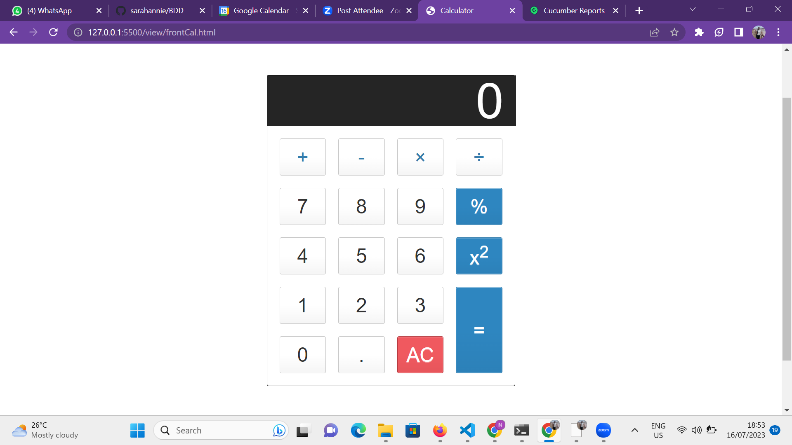

 Calculator

    
    
    

 # Test
the frontend was test with Selenium
while the backend was tested with Cucumber,js

## Step on installation
npm init -y  
npm install selenium-webdriver @cucumber/cucumber chai chromedriver

# to start the test
npm test

# Calculator Image

